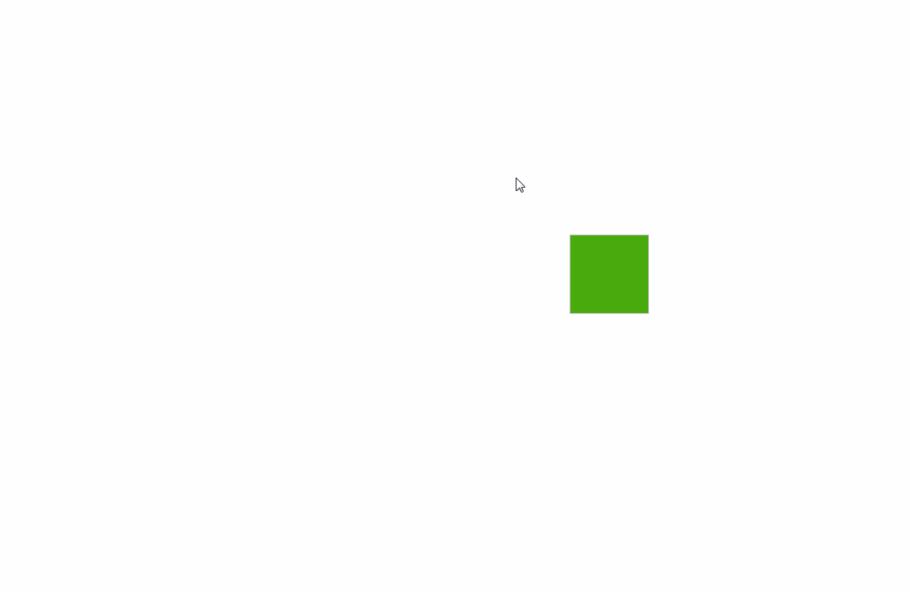
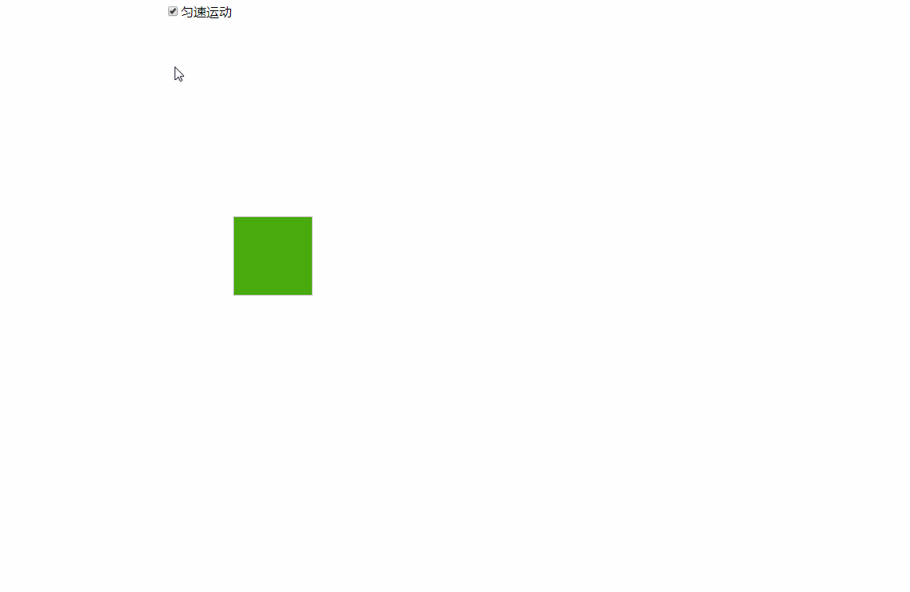
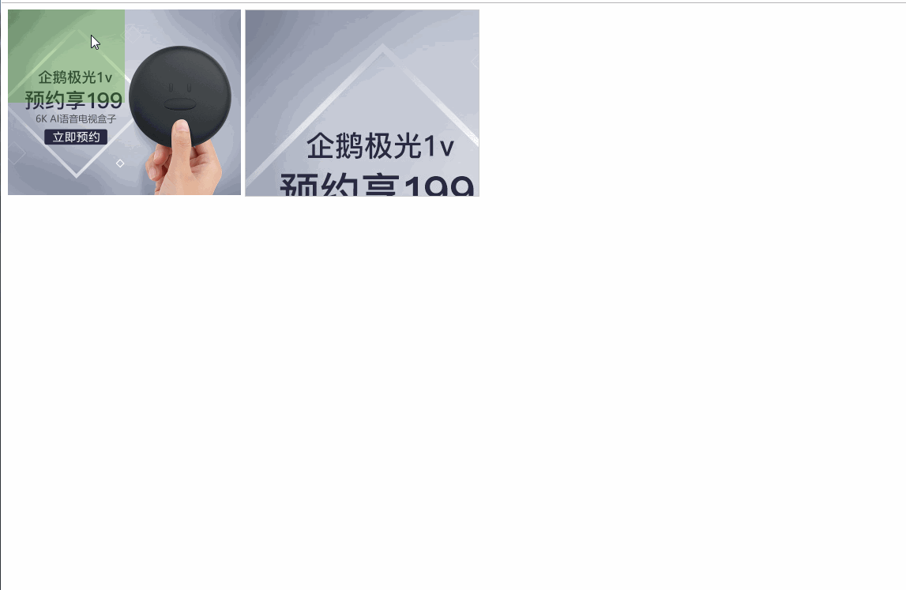

# 盒子的移动函数


### 鼠标跟随

实现效果


1.封装工具函数

后续每做一个特效就会将相应的工具封装在utils中

```javascript
var utils = {
    scroll:function(event) {
        var top = window.pageYOffset || document.body.scrollTop || document.documentElement.scrollTop;
        var left = window.pageXOffset || document.body.scrollLeft || document.documentElement.scrollLeft;
        return {
            "top": top,
            "left": left
        }
    },
    page:function(event) {
        var event = event || window.event;
        //距离页面的距离等于卷积的距离加鼠标距离浏览器的距离
        var pagex = event.pageX || this.scroll().left + event.clientX;
        var pagey = event.pageY || this.scroll().top + event.clientY;
        return {
            x:pagex,
            y:pagey,
            ex:event.clientX,
            ey:event.clientY
        };
    },
}
```


2.代码实现
```html
<!DOCTYPE html>
<html lang="en">
<head>
    <meta charset="UTF-8">
    <title>鼠标跟随</title>
</head>
<style>
    body {
        height: 5000px;
    }
    img {
        position: absolute;
        height: 100px;
        width: 100px;
        top: 100px;
        background-color: #48aa0d;
    }
</style>
<body>
</img>
</body>
<script src="utils.js"></script>
<script>

var img = document.getElementsByTagName("img")[0];
var body = document.getElementsByTagName("body")[0];
var mousePos = {
    left:undefined,
    top:undefined
};

document.onmousemove  = (function(e){
    var page = utils.page(e);
    img.style.left = page.x  + 'px';
    mousePos.left = page.ex;
    img.style.top = page.y + 'px';
    mousePos.top = page.ey;
});

document.onscroll = (function(e){
    //盒子距离页面顶部的距离等于鼠标离浏览器的距离加上卷积的距离
    var top = mousePos.top + document.documentElement.scrollTop + 'px';
    img.style.top = top;
});
</script>
</html>

```

3.问题总结
主要是利用obj.style 和obj.offset来完成实现。但是要注意的是，当页面被压缩出现滚动条时，我们操作滚轮不移动鼠标时，并不会触发onmousemove，
此时就会出现鼠标静止不动，盒子上移。但是我们想要的效果是盒子跟随鼠标，所以需要加上onscroll事件。

在触发onscroll时间时，是无法获取到event.clientX和event.clientY的，所以我们在onmousemove中将鼠标停止的位置记录下来，在所以需要加上onscroll事件中使用。


### 盒子匀速，缓速移动

实现效果



代码实现
```html
<!DOCTYPE html>
<html lang="en">
<head>
    <meta charset="UTF-8">
    <title>div动画</title>
</head>
<style>
    body {
        height: 5000px;
    }
    
    img {
        position: absolute;
        height: 100px;
        width: 100px;
        top: 100px;
        background-color: #48aa0d;
    }
</style>
<body>
</img>
</body>
<script src="utils.js"></script>
<script>

    var img = document.getElementsByTagName("img")[0];

    document.onclick = function () {
        //animate(img,utils.page(),1,false); 缓速
        animate(img,utils.page(),1,true);
    }


    /**
     * 盒子移动
     * @param obj 对象
     * @param target 目标位置{x:100,y:100}
     * @param n 时间 需要多少n秒完成
     * @param is_con 是否匀速 默认缓速
     */
    function animate(obj, target, n, is_con) {
        
        var pos = {x: obj.offsetLeft, y: obj.offsetTop};
        var time = n * 1000;//n秒内到达
        var unit = 20;
        
        var disX = Math.abs(pos.x - target.x);//距离
        var dirX = (target.x > pos.x ? 1 : -1);//方向
        var speedX = dirX * disX / time * unit;//步长
        // 要对步长进行处理   如果设置style.left = "25.42px"  ，offsetLeft会取整，得到25px，不处理会导致短距离缓速时无限循环，
        // 但是处理了之后由于累计误差会导致x先到达，Y后到达的情况
        speedX = speedX > 0 ? Math.ceil(speedX) : Math.floor(speedX);

        // 同上
        var disY = Math.abs(pos.y - target.y);
        var dirY = (target.y > pos.y ? 1 : -1);
        var speedY = dirY * disY / time * unit;
        speedY = speedY > 0 ? Math.ceil(speedY) : Math.floor(speedY);
        
        var sinw = function () {
            //当前对象的位置
            var pos2 = {x: obj.offsetLeft, y: obj.offsetTop};
            //当前对象距离目标的距离
            var disx = Math.abs(pos2.x - target.x);
            var disy = Math.abs(pos2.y - target.y);
            //选择是否匀速
            if(!is_con){
                speedX = (dirX == 1 ) ?  Math.ceil(1 / 10 * disx) : Math.floor(-1 / 10 * disx);
                speedY = (dirY == 1 ) ?  Math.ceil(1 / 10 * disy) : Math.floor(-1 / 10 * disy);
            }
            if (disx <= Math.abs(speedX) && disy <= Math.abs(speedY) ) {
                obj.style.left = target.x + 'px';
                obj.style.top = target.y + 'px';
                //清除定时器
                clearInterval(window.timer);
            } else {
                //避免累计误差导致xy不能同时到达时,,,一边的距离满足条件后只add不满足条件的一表
                if(!(disx <= Math.abs(speedX))){
                    obj.style.left = obj.offsetLeft + speedX + 'px';
                }
                if(!(disy <= Math.abs(speedY))){
                    obj.style.top = obj.offsetTop + speedY + 'px';
                }
            }
        };
        //启动前清楚定时器，防止多次触发
        clearInterval(window.timer);
        window.timer = setInterval(sinw, unit);
    }


</script>
</html>

```

3.总结

我们设置obj.style ='20.5px',当我们使用取的时候实际取到的值是20，当使用循环的时候累计误差会越来越大，这点要注意。

.jpg)

### 商品放大镜

1.实现效果



2.代码实现

```javascript
<!DOCTYPE html>
<html lang="en">
<head>
    <meta charset="UTF-8">
    <title>放大镜</title>
</head>
<style>
    #main {
        display: inline-block;
        position: relative;
        width: 295px;
        height: 235px;
        background: url("images/banner1.jpg") no-repeat 0 0;
        background-size: cover;
    }
    
    #big {
        position: absolute;
        display: inline-block;
        width: 295px;
        height: 235px;
        left: 300px;
        border: 1px solid #ccc;
        overflow: hidden;
    }
    
    #mask {
        position: relative;
        width: 148px;
        height: 118px;
        display: inline-block;
        background-color: #48aa0d;
        opacity: 0.3
        
    }


</style>
<body>
<div id="main">
    <div id="mask"></div>
    <div id="big">
        </img>
    </div>

</div>

</body>
<script src="utils.js"></script>
<script>
    var div = window.document.querySelectorAll("#main")[0];
    var maskdiv = window.document.querySelectorAll("#mask")[0];
    var bigdiv = window.document.querySelectorAll("#big")[0];
    var img = window.document.querySelectorAll("img")[0];

    var mw = div.offsetWidth;
    var mh = div.offsetHeight;
    var maskw = maskdiv.offsetWidth;
    var maskh = maskdiv.offsetHeight;
    var bigh = bigdiv.offsetHeight;
    var bigw = bigdiv.offsetWidth;

    div.onmousemove = function () {
        var page = utils.page();
        //4.用鼠标的位置减去盒子的位置获得鼠标在盒子内的位置。
        var x = page.ex - this.offsetLeft - maskw / 2;
        var y = page.ey - this.offsetTop - maskh / 2;

        //防止mask跑到外面去
        if (x < 0) {
            x = 0;
        }
        if (x >= mw - maskw) {
            x = mw - maskw;
        }

        //同上
        if (y < 0) {
            y = 0;
        }
        if (y >= mh - maskh) {
            y = mh - maskh;
        }
        maskdiv.style.left = x + "px";
        maskdiv.style.top = y + "px";

        //由于这个比例关系，当小盒子移动，大盒子等比移动
        bigh / maskh == bigw / maskw;

        var bili = bigh / maskh;
        var xx = bili * x;  //知道比例，就可以移动大图片了
        var yy = bili * y;

        img.style.marginTop = -yy + "px";
        img.style.marginLeft = -xx + "px";

    }

</script>
</html>

```

3.总结

主要利用盒子的等比关系和obj.style和offset完成代码
