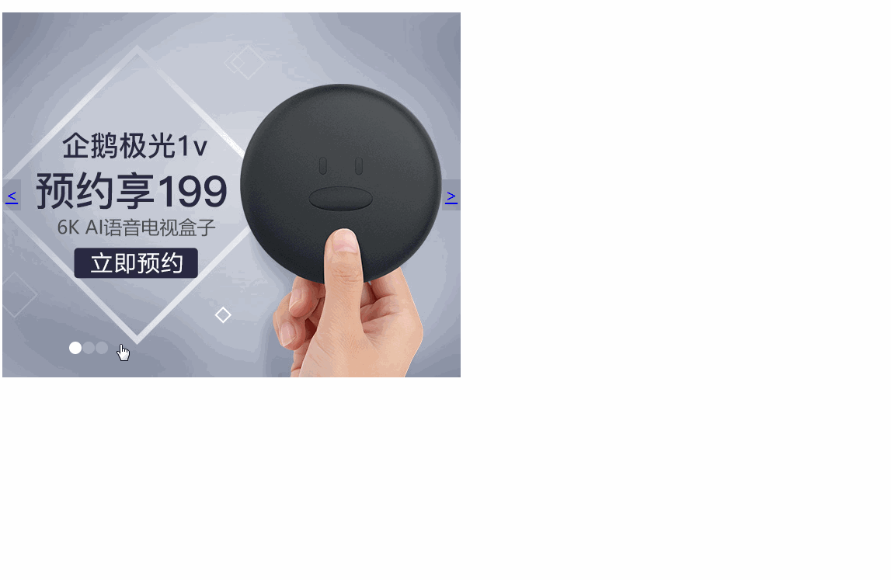

# 轮播图

### 无缝滑动轮播

#### 实现效果


#### 1.原理
 
 一系列的大小相等的图片平铺，利用CSS布局只显示一张图片，其余隐藏。通过计算偏移量利用定时器实现自动播放，或通过手动点击事件切换图片。
无缝滚动。当从最后一张图切换回第一张图时，有很大空白，利用两张辅助图来填补这个空白。
这里补充下无缝滚动，直接看代码，复制最后一张图片放置第一张图片前，同时复制第一张图片放置最后一张图片的后面。并且，将第一张图片辅助图（实际上是实际显示的第5张图片隐藏起来，故设置style="left: -imgWidth px;"）

####  2.代码实现

```javascript
<!DOCTYPE html>
<html lang="en">
<head>
    <meta charset="UTF-8">
    <title>平滑轮播图</title>
</head>
<style>
    .main-slider {
        padding-top: 10px;
        position: relative;
        width: 590px;
        height: 480px;
        overflow: hidden;
    }
    
    .slider-order {
        position: absolute;
        left: 46px;
        bottom: 20px;
        text-align: center;
        z-index: 1;
    }
    
    .slider-order li {
        display: inline-block;
        width: 16px;
        height: 16px;
        border-radius: 50%;
        text-align: center;
        background: hsla(0, 0%, 100%, .2);
        margin-right: 1px;
    }
    
    .arrow-left, .arrow-right {
        position: absolute;
        z-index: 1;
        display: inline-block;
        height: 40px;
        width: 24px;
        background-color: rgba(0, 0, 0, 0.1);
        top: 50%;
        margin-top: -20px;
        text-align: center;
        vertical-align: middle;
        font: 400 22px/40px "sumsun";
        
    }
    
    .arrow-left {
        left: 0px;
    }
    
    .arrow-right {
        right: 0px;
    }
    
    .arrow-left:hover, .arrow-right:hover {
        background-color: rgba(0, 0, 0, 0.4);
    }
    
    .slider-bg a {
        display: inline-block;
        float: left;
        
    }
    
    .slider-bg {
        position: absolute;
    }
    
    .slider-order .active {
        background-color: white;
    }
</style>
<body>
<div class="main-slider">
    <div class="slider-bg" style="">
        <a href="">
            
        </a>
        <a href="">
            
        </a>
        <a href="">
            
        </a>
    </div>
    <ul class="slider-order">
    </ul>
    <a href="javascript:;" class="arrow-left">&lt;</a>   <!--左边的箭头-->
    <a href="javascript:;" class="arrow-right">&gt;</a>  <!--右边的箭头-->
</div>
</body>
<script>
    (function (element) {
        //初始化时背景图序号
        var bgnum = 1;
        var bgWidth = 590;
        var isMove = false;

        //获取索引ul
        var order = element.getElementsByClassName('slider-order')[0];

        //获取背景
        var bg = element.getElementsByClassName('slider-bg')[0];
        var imglen = bg.children.length;

        //初始化盒子位置
        bg.style.left = -1 * bgWidth + "px";
        bg.style.width = bgWidth * imglen + "px";

        //按照图片数量添加下方索引图标
        bg.style.width = (imglen + 2) * bgWidth + 'px';
        for (var i = 0; i < imglen; i++) {
            var li = document.createElement("li")
            if (i == 0) {
                li.className = "active";
            }
            order.appendChild(li);
        }
        
        //获取所有索引
        var orders = order.getElementsByTagName('li');

        //盒子移动，前一章节有说明
        function animate(ele, target) {
            clearInterval(ele.timer);
            var s = 10;
            var ms = 20;
            var speed = target > ele.offsetLeft ? s : 0 - s;
            ele.timer = setInterval(function () {
                var val = target - ele.offsetLeft;
                if (Math.abs(val) < Math.abs(speed)) {
                    ele.style.left = target + "px";
                    clearInterval(ele.timer);
                    isMove = false;
                } else {
                    ele.style.left = ele.offsetLeft + speed + "px";
                }
            }, ms)
        }


        //在图片的第一张前加上最后一张，在最后一张的后方加上第一张，到达平滑移动的效果
        var frist = bg.children[0];
        var last = bg.children[imglen - 1];
        bg.appendChild(frist.cloneNode(true));
        bg.insertBefore(last.cloneNode(true), frist);

        //给每一个索引加上事件，平滑移动到自己所对应的背景
        for (var i = 0; i < orders.length; i++) {
            orders[i].index = i + 1;
            orders[i].onmouseover = function (ev) {
                for (var j = 0; j < orders.length; j++) {
                    orders[j].className = '';
                }
                bgnum = this.index;
                this.className = 'active';
                animate(bg, -this.index * bgWidth)
            }
        }

        //下一步
        function next() {
            if (isMove) {
                return;
            }
            isMove = true;
            ++bgnum;
            if (bgnum > imglen) {
                bgnum = 1;
                bg.style.left = "0px";
            }
            //清除所有样式后在加上
            for (var j = 0; j < imglen; j++) {
                orders[j].className = '';
            }
            orders[bgnum - 1].className = 'active';
            animate(bg, -bgnum * bgWidth);
        }

        //上一步
        function pre() {
            if (isMove) {
                return;
            }
            isMove = true;
            --bgnum;
            if (bgnum < 0) {
                bgnum = imglen - 1;
                bg.style.left = -bgWidth * (imglen) + "px";
            }
            for (var j = 0; j < imglen; j++) {
                orders[j].className = '';
            }
            var cur = bgnum == 0 ? imglen - 1 : bgnum - 1;
            orders[cur].className = 'active';
            animate(bg, -bgnum * bgWidth);
        }

        //绑定事件
        element.getElementsByClassName('arrow-left')[0].onclick = pre;

        element.getElementsByClassName('arrow-right')[0].onclick = next;

        //添加定时器，自动轮播
        var timer = setInterval(next, 3000);

        //鼠标移动到背景时取消轮播
        element.onmouseover = function () {
            clearInterval(timer);
        }

        //鼠标离开后重新开始轮播
        element.onmouseout = function () {
            timer = setInterval(next, 3000);
        }

    })(window.document.querySelectorAll('.main-slider')[0]);
</script>
</html>

```

### 渐变轮播图

#### 实现效果


#### 1.原理
 
点击下一页时，通过定时器对元素的透明读进行改变，让原本{display:block;opacity:1}的元素逐渐变成{display:none;opacity:0},
原本{display:none;opacity:0}的元素逐渐变成{display:block;opacity:1}。
 
#### 2.代码实现

```javascript
<!DOCTYPE html>
<html lang="en">
<head>
    <meta charset="UTF-8">
    <title>渐变轮播图</title>
</head>
<style>
    .main-slider {
        padding-top: 10px;
        position: relative;
        width: 590px;
        height: 480px;
        overflow: hidden;
    }
    
    .slider-order {
        position: absolute;
        left: 46px;
        bottom: 20px;
        text-align: center;
        z-index: 1;
    }
    
    .slider-order li {
        display: inline-block;
        width: 16px;
        height: 16px;
        border-radius: 50%;
        text-align: center;
        background: hsla(0, 0%, 100%, .2);
        margin-right: 1px;
    }
    
    .arrow-left, .arrow-right {
        position: absolute;
        z-index: 1;
        display: inline-block;
        height: 40px;
        width: 24px;
        background-color: rgba(0, 0, 0, 0.1);
        top: 50%;
        margin-top: -20px;
        text-align: center;
        vertical-align: middle;
        font: 400 22px/40px "sumsun";
        
    }
    
    .arrow-left {
        left: 0px;
    }
    
    .arrow-right {
        right: 0px;
    }
    
    .arrow-left:hover, .arrow-right:hover {
        background-color: rgba(0, 0, 0, 0.4);
    }
    
    .slider-bg a {
        position: absolute;
        left: 0px;
        display: inline-block;
        float: left;
        
    }
    
    .slider-bg {
        position: absolute;
    }
    
    .slider-order .active {
        background-color: white;
    }
</style>
<body>
<div class="main-slider">
    <div class="slider-bg" style="">
        <a href="">
            
        </a>
        <a href="">
            
        </a>
        <a href="">
            
        </a>
    </div>
    <ul class="slider-order">
    </ul>
    <a href="javascript:;" class="arrow-left">&lt;</a>   <!--左边的箭头-->
    <a href="javascript:;" class="arrow-right">&gt;</a>  <!--右边的箭头-->
</div>
</body>
<script>
    (function (element) {
        //初始化时背景图序号
        var bgnum = 0;
        var bgWidth = 590;

        //获取索引ul
        var order = element.getElementsByClassName('slider-order')[0];

        //获取背景
        var bg = element.getElementsByClassName('slider-bg')[0];
        var imglen = bg.children.length;

        //初始化盒子位置
        for (var j = 0; j < imglen; j++) {
            bg.children[j].style.display = 'none';
        }
        bg.children[0].style.display = 'block';

        //按照图片数量添加下方索引图标
        bg.style.width = (imglen + 2) * bgWidth + 'px';
        for (var i = 0; i < imglen; i++) {
            var li = document.createElement("li")
            if (i == 0) {
                li.className = "active";
            }
            order.appendChild(li);
        }

        //获取所有索引
        var orders = order.getElementsByTagName('li');

        //盒子渐变
        function fade(ele, isOut, time) {
            clearInterval(ele.timer);
            ele.opacity = isOut ? 1 : 0;
            var speed = isOut ? -0.1 : 0.1;
            var unit = Math.abs(time / (1 / speed));
            if(!isOut){
                ele.style.display = "block";
                ele.style.opacity = 0;
            }
            ele.timer = setInterval(function () {
                var opacity = ele.opacity + speed;
                //这里要注意，对于浮点数的计算千万不要用等于
                if (Math.abs(opacity) < 0.01) {
                    ele.style.opacity = opacity;
                    ele.opacity = opacity;
                    ele.style.display = "none";
                    clearInterval(ele.timer);
                } else if (Math.abs(opacity  - 1) < 0.01) {
                    ele.style.opacity = opacity;
                    ele.opacity = opacity;
                    clearInterval(ele.timer);
                } else {
                    ele.style.opacity = opacity;
                    ele.opacity = opacity;
                }
            }, unit)
        }

        //给每一个索引加上事件，平滑移动到自己所对应的背景
        for (var i = 0; i < orders.length; i++) {
            orders[i].index = i;
            orders[i].onclick = function (ev) {
                for (var j = 0; j < orders.length; j++) {
                    orders[j].className = '';
                }
                this.className = 'active';
                fade(bg.children[bgnum], true, 500);
                bgnum = this.index;
                fade(bg.children[this.index], false, 500);
            }
        }
        
        function next(){
            fade(bg.children[bgnum], true, 500);
            ++bgnum;
            if(bgnum >= imglen){
                bgnum = 0;
            }
            fade(bg.children[bgnum], false, 500);
            for (var j = 0; j < imglen; j++) {
                orders[j].className = '';
            }
            orders[bgnum].className = 'active';
        }

        function pre(){
            
            fade(bg.children[bgnum], true, 500);
            --bgnum;
            if(bgnum < 0){
                bgnum = imglen -1;
            }
            fade(bg.children[bgnum], false, 500);
            for (var j = 0; j < imglen; j++) {
                orders[j].className = '';
            }
            orders[bgnum].className = 'active';
        }

        //绑定事件
        element.getElementsByClassName('arrow-left')[0].onclick = pre;

        element.getElementsByClassName('arrow-right')[0].onclick = next;

        //添加定时器，自动轮播
        var timer = setInterval(next, 3000);

        //鼠标移动到背景时取消轮播
        element.onmouseover = function () {
            clearInterval(timer);
        }

        //鼠标离开后重写开始轮播
        element.onmouseout = function () {
            timer = setInterval(next, 3000);
        }

    })(window.document.querySelectorAll('.main-slider')[0]);
</script>
</html>

```

### 常规轮播图

#### 实现效果


#### 1.原理

通过改变切换元素的display状态实现背景的切换。

#### 2.代码实现

```javascript
<!DOCTYPE html>
<html lang="en">
<head>
    <meta charset="UTF-8">
    <title>常规轮播图</title>
</head>
<style>
    .main-slider {
        padding-top: 10px;
        position: relative;
        width: 590px;
        height: 480px;
        overflow: hidden;
    }
    
    .slider-order {
        position: absolute;
        left: 46px;
        bottom: 20px;
        text-align: center;
        z-index: 1;
    }
    
    .slider-order li {
        display: inline-block;
        width: 16px;
        height: 16px;
        border-radius: 50%;
        text-align: center;
        background: hsla(0, 0%, 100%, .2);
        margin-right: 1px;
    }
    
    .arrow-left, .arrow-right {
        position: absolute;
        z-index: 1;
        display: inline-block;
        height: 40px;
        width: 24px;
        background-color: rgba(0, 0, 0, 0.1);
        top: 50%;
        margin-top: -20px;
        text-align: center;
        vertical-align: middle;
        font: 400 22px/40px "sumsun";
        
    }
    
    .arrow-left {
        left: 0px;
    }
    
    .arrow-right {
        right: 0px;
    }
    
    .arrow-left:hover, .arrow-right:hover {
        background-color: rgba(0, 0, 0, 0.4);
    }
    
    .slider-bg a {
        position: absolute;
        left: 0px;
        display: inline-block;
        float: left;
        
    }
    
    .slider-bg {
        position: absolute;
    }
    
    .slider-order .active {
        background-color: white;
    }
</style>
<body>
<div class="main-slider">
    <div class="slider-bg" style="">
        <a href="">
            
        </a>
        <a href="">
            
        </a>
        <a href="">
            
        </a>
    </div>
    <ul class="slider-order">
    </ul>
    <a href="javascript:;" class="arrow-left">&lt;</a>   <!--左边的箭头-->
    <a href="javascript:;" class="arrow-right">&gt;</a>  <!--右边的箭头-->
</div>
</body>
<script>
    (function (element) {
        //初始化时背景图序号
        var bgnum = 0;
        var bgWidth = 590;

        //获取索引ul
        var order = element.getElementsByClassName('slider-order')[0];

        //获取背景
        var bg = element.getElementsByClassName('slider-bg')[0];
        var imglen = bg.children.length;

        //初始化盒子位置
        for (var j = 0; j < imglen; j++) {
            bg.children[j].style.display = 'none';
        }
        bg.children[0].style.display = 'block';

        //按照图片数量添加下方索引图标
        bg.style.width = (imglen + 2) * bgWidth + 'px';
        for (var i = 0; i < imglen; i++) {
            var li = document.createElement("li")
            if (i == 0) {
                li.className = "active";
            }
            order.appendChild(li);
        }

        //获取所有索引
        var orders = order.getElementsByTagName('li');

        //盒子显示与隐藏
        function trigger(ele) {
            if (!ele.style.display) {
                ele.style.display = "none"
            } else {
                ele.style.display = ele.style.display == "none" ? "block" : "none";
            }
        }

        //给每一个索引加上事件，平滑移动到自己所对应的背景
        for (var i = 0; i < orders.length; i++) {
            orders[i].index = i;
            orders[i].onclick = function (ev) {
                for (var j = 0; j < orders.length; j++) {
                    orders[j].className = '';
                }
                this.className = 'active';
                trigger(bg.children[bgnum]);
                bgnum = this.index;
                trigger(bg.children[bgnum]);
            }
        }

        function next() {
            trigger(bg.children[bgnum], true, 500);
            ++bgnum;
            if (bgnum >= imglen) {
                bgnum = 0;
            }
            trigger(bg.children[bgnum]);
            for (var j = 0; j < imglen; j++) {
                orders[j].className = '';
            }
            orders[bgnum].className = 'active';
        }

        function pre() {

            trigger(bg.children[bgnum], true, 500);
            --bgnum;
            if (bgnum < 0) {
                bgnum = imglen - 1;
            }
            trigger(bg.children[bgnum], false, 500);
            for (var j = 0; j < imglen; j++) {
                orders[j].className = '';
            }
            orders[bgnum].className = 'active';
        }

        //绑定事件
        element.getElementsByClassName('arrow-left')[0].onclick = pre;

        element.getElementsByClassName('arrow-right')[0].onclick = next;

        //添加定时器，自动轮播
        var timer = setInterval(next, 3000);

        //鼠标移动到背景时取消轮播
        element.onmouseover = function () {
            clearInterval(timer);
        }

        //鼠标离开后重写开始轮播
        element.onmouseout = function () {
            timer = setInterval(next, 3000);
        }

    })(window.document.querySelectorAll('.main-slider')[0]);
</script>
</html>


```
