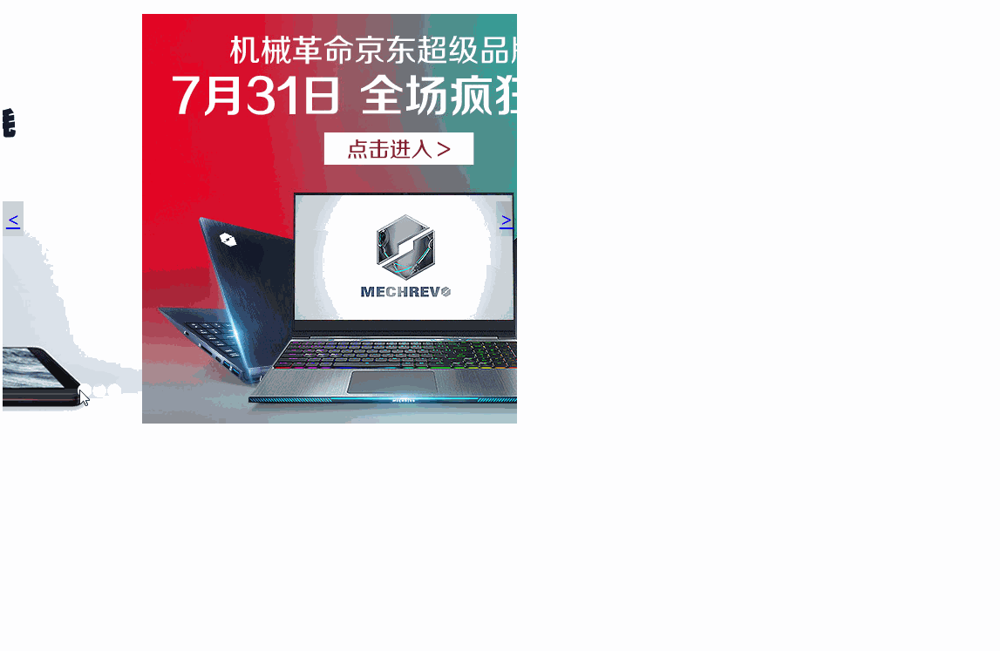

# 网页常见特效-选项卡,下拉框,移入移出

### 选项卡页面

#### 实现效果



#### 1.原理

通过触发标题栏的onmouseover事件，将与自身索引相同的page显示

#### 2.代码实现
```javascript
<!DOCTYPE html>
<html lang="en">
<head>
    <meta charset="UTF-8">
    <title>Title</title>
</head>
<body>
<style>
    .box a {
        display: inline-block;
        text-align: center;
    }
    
    .box .page {
        padding: 0 15px;
        width: 200px;
        display: none;
        margin-top: 9px;
    }
    
    .box .title {
        padding: 0 15px;
    }
    
    .box .page p {
        line-height: 22px;
        white-space: nowrap;
        text-overflow: ellipsis;
        overflow: hidden;
        color: #999;
    }
    
    .box a.active {
        border-bottom: red 2px solid;
    }
    
    .box div.active {
        display: block;
    }
</style>
<div class="box">
    <div class="title">
        <a class="active" href="javascript:void(0)">促销</a>
        <span class="spacer">|</span>
        <a href="javascript:void(0)">公告</a>
    </div>
    <div>
        <div class="page active">
            <ul>
                <li><p>旗舰电竞低至4折！旗舰电竞低至4折！</p></li>
                <li><p>Segway平衡轮新品首发旗舰电竞低至4折！</p></li>
                <li><p>潮流新品，大牌推荐旗舰电竞低至4折！</p></li>
                <li><p>奥妙-向伟大的母亲致净旗舰电竞低至4折！</p></li>
            </ul>
        </div>
        <div class="page">
            <ul>
                <li><p>国际顶级奢侈品品牌Balenci</p></li>
                <li><p>京东PLUS会员权益更新及会</p></li>
                <li><p>京东启用全新客服电话“95</p></li>
                <li><p>关于召回普利司通（天津）</p></li>
            </ul>
        </div>
    </div>
</div>
<script>
    var boxs = window.document.querySelectorAll('.box');
    for (var i = 0; i < boxs.length; i++) {
        fn(boxs[i]);
    }

    function fn(element) {
        var arra = element.getElementsByTagName("a");
        var pages = element.getElementsByClassName("page");
        for (var n = 0; n < arra.length; n++) {
            arra[n].onmouseover = function () {
                for (var i = 0; i < arra.length; i++) {
                    arra[i].className = arra[i].className.replace('active', '');
                    arra[i].index = i;
                    pages[i].className = pages[i].className.replace('active', '');
                }
                // 把所有active移除，激活自己和对应的page
                this.className = this.className + ' active';
                pages[this.index].className = pages[this.index].className + ' active';
            }
        }
    }
</script>
</body>
</html>

```


### 下拉列表

#### 实现效果


下面是京东的页面，原理相同


#### 1.原理
 
通过position将想要达到的效果先设计出来，然后使用display进行显示和隐藏的效果

通常使用的布局是
```html
<div style="position:relative">
    <a style="position:relative;display: block" href="">这里有咸鱼卖</a>
    <div style="position: absolute;display: none">
        <ul>
            <li>咸鱼A</li>
            <li>咸鱼B</li>
            <li>咸鱼C</li>
            <li>咸鱼D</li>
            <li>咸鱼E</li>
        </ul>
</div>
</div>
```

#### 2.代码实现

```javascript
<!DOCTYPE html>
<html lang="en">
<head>
    <meta charset="UTF-8">
    <title>Title</title>
</head>
<style>
    *{
        margin: 0;
        padding: 0;
    }
    
    body{
        font-size: 14px;
        font-family: sans-serif;
    }
    #navigation,#navigation li ul{
        list-style-type: none;
    }
    #navigation li{
        float: left;
        text-align: center;
        position: relative;
    }
    #navigation li a:link,#navigation li a:visited{
        display: block;
        text-decoration: none;
        color: #000;
        width: 160px;
        height: 40px;
        line-height: 40px;
        border: 1px solid #fff;
        background: #c5dbf2;
        border-width: 1px 1px 0 0;
    }
    #navigation li a:hover{
        color: #fff;
        background: #2687eb;
    }
    #navigation li ul li{
        float: none;
    }
    #navigation li ul{
        display: none;
        position: absolute;       /*二级ul使用绝对定位，宽度大于一级菜单时，才不会撑大一级*/
        
    }
    #navigation li ul li a:link,#navigation li ul li a:visited{
        display: block;
        width: 160px;
    }
</style>

</head>
<body>
<ul id="navigation">
    <li><a href="#">首页</a></li>
    <li onmouseover="showSubMenu(this)" onmouseout="hideSubMenu(this)"><a href="#">服务</a>
        <ul>
            <li><a href="#">服务一</a></li>
            <li><a href="#">服务二</a></li>
            <li><a href="#">服务三</a></li>
            <li><a href="#">服务四</a></li>
            <li><a href="#">服务五</a></li>
        </ul>
    </li>
    <li onmouseover="showSubMenu(this)" onmouseout="hideSubMenu(this)"><a href="#">团队</a>
        <ul>
            <li><a href="#">团队一</a></li>
            <li><a href="#">团队二</a></li>
            <li><a href="#">团队三</a></li>
            <li><a href="#">团队四</a></li>
            <li><a href="#">团队五</a></li>
        </ul>
    </li>
    <li><a href="#">方向</a></li>
</ul>
</body>
<script type="text/javascript">
    //显示子菜单
    function showSubMenu(li){
        var subMenu = li.getElementsByTagName("ul")[0];
        subMenu.style.display = "block";
    }

    //隐藏子菜单
    function hideSubMenu(li){
        var subMenu = li.getElementsByTagName("ul")[0];
        subMenu.style.display = "none";
    }
</script>
</html>

```

### 移入移出

#### 实现效果


#### 1.原理

通过父r子a的布局，在通过移动盒子来完成

#### 2.代码实现
```javascript
<!DOCTYPE html>
<html lang="en">
<head>
    <meta charset="UTF-8">
    <title>移入移出</title>
</head>
<style type="text/css">
    #div1 span {
        width: 70px;
        height: 50px;
        background:greenyellow;
        position: absolute;
        left: 200px;
        top: 75px;
    }
    
    #div1 {
        width: 200px;
        height: 200px;
        background: red;
        position: absolute;
        left: -200px;
        top: 0;
    }
</style>

</head>
<body>
<div id="div1">
    分享至XXXXXX
<span id="share">
点击分享
</span>
</div>
</body>
<script type="text/javascript">

    var div1 = document.getElementById("div1");
    div1.onmouseover = function () {
        startMove(0);
    }
    div1.onmouseout = function () {
        startMove(-200);
    }

    var timer = null;
    
    //移动盒子，可参考第2章
    function startMove(iTarget) {
        clearInterval(timer);
        var div1 = document.getElementById("div1");
        timer = setInterval(function () {
            var speed = 0;
            if (div1.offsetLeft > iTarget) {
                speed = -10;
            } else {
                speed = 10;
            }
            if (div1.offsetLeft == iTarget) {
                clearInterval(timer);
            } else {
                div1.style.left = div1.offsetLeft + speed + 'px';
            }
        }, 30);
    }
    
</script>
</html>

```
