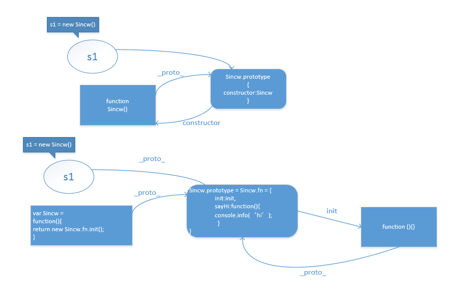

#JQuery结构

## 1、总体架构

### 1.1 自调用匿名函数,闭包

> 立即调用表达式

利用JS的函数表达式声明的函数不需要函数名，获取函数表达式后我们可以直接在其后加入（）直接执行。
```javascript
//利于函数表达式声明函数时的调用函数的方法
var sincw = function(){
    console.info('sincw')
};
sincw();// print: sincw

//进行简化--报错，这样就变成了函数式声明，必须要写函数名
function(){
    console.info('sincw') //throw error;
}();
```

我们了解一个()的用法，首先()是一种运算符，它有两种用法：
- 1.(expression)：表示对expression进行求值，并且return求值的result。
- 2.functionName()：表示调用函数functionName。

```javascript
//使用括号避免function变成函数式声明,并可以传递参数
(function(name) {
    console.info(name);// print: sincw
})('sincw');
```

匿名函数可以有效的保证在页面上写入JavaScript，而不会造成全局变量的污染，
通过小括号，让其加载的时候立即初始化，这样就形成了一个单例模式的效果从而只会执行一次。

>jQuery1.0

立即函数的写法是这样的，为什么只传递了window对象，却接受了两个参数？
```javascript
(function( window, undefined) {
    //dosomething
})(window);
```

因为在早期的浏览器运行环境中，JS中是可以被赋值的。
```javascript
(function( window) {
    var sincw;
    if(sincw == undefined){ //true
        console.info("Hi, I am sincw1")
    }
})(window);  

undefined = 'sincw';

(function(window) {
    var sincw;
    if(sincw == undefined){ //false
        console.info("Hi, I am sincw2")
    }
})(window);

(function( window, undefined) {
    var sincw; 
    if(sincw == undefined){ //true
        console.info("Hi, I am sincw3")
    }
})(window);
```
还有一个原因就是
window和undefined都是为了减少变量查找所经过的scope作用域。


>jQuery2.0

原理跟上面一样，利用上面的写法把整个函数作为参数传递给另一个函数，主要是为了判断JQuery在不同
平台下的加载逻辑。
```javascript
(function(window, factory) {
    factory(window)
}(this, function() {
    return function() {
       //jQuery的调用
    }
}))
```
在AMD和commonJS下的加载方式就有所不同。
```javascript
if (typeof module === "object" && typeof module.exports === "object") {
    module.exports = global.document ?
        factory(global, true) :
        function(w) {
            if (!w.document) {
                throw new Error("jQuery requires a window with a document");
            }
            return factory(w);
    };
} else {
    factory(global);
}
```


### 1.2 无new 构造


```javascript
// 无 new 构造
var test =  $('#test');

// 当然也可以使用 new
var test = new $('#test');

```

直接 $('') 进行构造，这也是 jQuery 十分便捷的一个地方。当我们使用第一种无 new 构造方式的时候，其本质就是相当于 new jQuery()，那么在 jQuery 内部是如何实现的呢？

```javascript
(function(window, undefined) {
    var
    // ...
    jQuery = function(selector, context) {
        // The jQuery object is actually just the init constructor 'enhanced'
        // 看这里，实例化方法 jQuery() 实际上是调用了其拓展的原型方法 jQuery.fn.init
        return new jQuery.fn.init(selector, context, rootjQuery);
    },
 
    // jQuery.prototype 即是 jQuery 的原型，挂载在上面的方法，即可让所有生成的 jQuery 对象使用
    jQuery.fn = jQuery.prototype = {
        // 实例化化方法，这个方法可以称作 jQuery 对象构造器
        init: function(selector, context, rootjQuery) {
            // ...
        }
    }
    // 这一句很关键，也很绕
    // jQuery 没有使用 new 运算符将 jQuery 实例化，而是直接调用其函数
    // 要实现这样,那么 jQuery 就要看成一个类，且返回一个正确的实例
    // 且实例还要能正确访问 jQuery 类原型上的属性与方法
    // jQuery 的方式是通过原型传递解决问题，把 jQuery 的原型传递给jQuery.prototype.init.prototype
    // 所以通过这个方法生成的实例 this 所指向的仍然是 jQuery.fn，所以能正确访问 jQuery 类原型上的属性与方法
    jQuery.fn.init.prototype = jQuery.fn;
 
})(window);
```

下面是我们正常new函数时建立的原线链的关系和Jquery调整后的关系，可以看到，jQuery并没有返回其本身，而是返回了他的原型链中fn下的init函数。init函数的原型指向了jQuery.fn,
这样返回的对象就能够调用fn中的例如sayHi方法。



