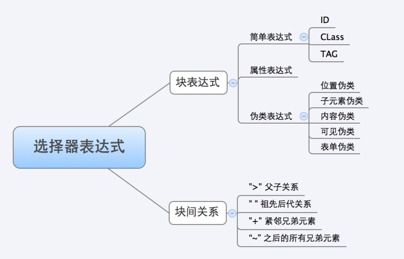

# Sizzle
首先介绍一下什么是Sizzle：

Sizzle是一个纯javascript CSS选择器引擎。jquery1.3开始使用sizzle，Sizzle一反传统采取了相反的Right To Left的查询匹配方式,效率提高.Sizzle是jQuery作者John Resig新写的DOM选择器引擎,速度号称业界第一

### 选择器原理

> 为什么要使用Sizzle

```javascript
if(document.querySelectorAll) {
    sizzle = function(query, context) {
        return makeArray(context.querySelectorAll(query));
     }
} else {
    sizzle 引擎实现，主要模拟querySelectorAll
}
```

假如所有浏览器都支持该API，那Sizzle就没有存在的意义了，虽然有些环境实现了方法querySelectorAll，但是会有bug。
在低版本浏览器中，Sizzle大显身手，但是在高版本浏览器中就没有那么大的差别了。

> 选择器常用名词

- 选择器表达式： "div > p"  
- 块表达式： "div" "p"  
- 并列选择器表达式： "div, p"  
- 块分割器： Sizzle中的chunker正则，对选择器表达式从左向右分割出一个个块表达式  
- 查找器： 对块表达式进行查找，找到的DOM元素数组叫候选集.Sizzle.find: 主查找函数  
- 过滤器： 对块表达式和候选集进行过滤.Sizzle.filter: 主过滤函数
- 关系过滤器 对块表达式之间的关系进行过滤，共有四种关系："+" 紧挨着的兄弟关系；">" 父子关系；"" 祖先关系；"~" 之后的所有兄弟关系。Sizzle.selectors.relative: 块间关系处理函数集 {“+”: function() {}, “ ”:function() {}, “>”: function() {}, “~”: function() {}}
- 候选集： 查找器的结果，待过滤器进行过滤  
- 映射集： 候选集的副本，过滤器和关系过滤器对映射集进行过滤  


### 选择器工作流程：  


#### 1.分割解析
使用块分割器对选择器表达式进行分割，从左向右如果遇到用逗号","分割的并列选择器表达式，只分割至第一个逗号前边的选择器表达式1，将剩余部分记录下来 
例：对于如div > p。会得到数组结果['div','>','p']。
对于更复杂的选择器，如div.classname > p.classname。会得到结果['div.classname','>','p.classname']。


具体实现如下

```html
    var chunker = chunker = /((?:\((?:\([^()]+\)|[^()]+)+\)|\[(?:\[[^\[\]]*\]|['"][^'"]*['"]|[^\[\]'"]+)+\]|\\.|[^ >+~,(\[\\]+)+|[>+~])(\s*,\s*)?((?:.|\r|\n)*)/g;
    
    var soFar = '#J-con  ul>li:gt(2)';
    
    var m,extra,parts = [];
    do {
        chunker.exec( "" ); // chunker.lastIndex = 0
        m = chunker.exec( soFar );
        if ( m ) {
            soFar = m[3];
            parts.push( m[1] );
            if ( m[2] ) {
                extra = m[3];
                break;
            }
        }
    } while ( m );

    console.info(parts);
    console.info(extra);
```




#### 2.块表达式查找

对于 div > p 有两种方式可以得到我们想要的结果
- 从左往右：
先找到第一个div元素，在获取div下的直接子元素p，需要对得到的集合，进行内部逐个遍历，得到新的元素集合，只要还有剩余的代码块，就需要不断地重复查找、过滤的操作。
不断查询，不断缩小上下文，不断地得到新的元素集合,从DOM的上层往底层进行的，需要不断遍历子元素或后代元素，而一个元素节点的子元素或后代元素的个数是未知的或数量较多的.


- 从右往左：
先找到所有P元素，在判断他的父元素是不是div。对得到的元素集合，肯定包括了最终的元素，而且还有多余的、不符合条件的元素，那么接下来的工作就是不断过滤，把不符合条件的元素剔除掉。
一次查询，多次过滤，第一查找得到的元素集合不断缩小，知道得到最终的集合,从DOM的底层往上层进行的，需要不断遍历父元素或祖先元素，而一个元素的父元素或者祖先元素的数量是固定的或者有限的

对于“相邻的兄弟关系(+)”、“之后的兄弟关系(~)”,哪种方式都无所谓了，效率没什么区别。但是对于“父子关系”、“祖先后代关系”就不一样了，此时Sizzle选择的是以从右到左为主,

从左往右速度是快了很多，但是真的可以替代从右往左吗？

```html
<div><span>1</span></div>
<div class="context">
<span>2</span>
<span>3</span>
</div>

求$('.context > span:first')

我们从右往左查询

查找 S = span:first ==>  ['<span>1</span>']
过滤 S.parent().isContainClass('content'); ==> null

```

当我们使用伪类选择器，就会出现这样的错误，这个时候，为了准备，只能从左往右。

#####  块内查找
在查找环节，通过Sizzle.find来实现，主要逻辑如下

- 对块表达式进行匹配，匹配成功则从查找函数集Expr.find获取对应的查找函数执行  

- 对最后一个块表达式进行查找，查找器Sizzle.find从正则集Expr.match获取对应的正则表达式，，结果放入候选集set，

- 并将块表达式中匹配的字符串部分删除  

- 查找顺序定义在Expr.order中，依次是：ID CLASS NAME TAG，查找时CLASS需要浏览器支持getElementsByClassName  


```javascript
// Expr.order = [“ID”, [ “CLASS”], “NAME”, “TAG ]
for ( i = 0, len = Expr.order.length; i < len; i++ ) {
    ……
    if ( (match = Expr.leftMatch[ type ].exec( expr )) ) {
        set = Expr.find[ type ]( match, context);
        expr = expr.replace( Expr.match[ type ], "" );
    }
}
```


##### 块内过滤

该过程通过Sizzle.filter来进行，该API不仅可以进行块内过滤，还可以进行块间过滤，通过inplace参数来确定。主要逻辑如下：

- Expr.filter： {PSEUDO, CHILD, ID, TAG, CLASS, ATTR, POS} ， 选则器表达式的类型

- Expr.preFilter： 过滤前预处理，保证格式的规范化

- Expr.filter： 过滤的具体实现对象

- 内过滤、块间从左到后: inplace=false,返回新对象；块间从右到左: inplace=true, 原来的元素集合上过滤

```javascript
Sizzle.filter = function( expr, set, inplace, not ) {
    for ( type in Expr.filter ) { //filter： {PSEUDO, CHILD, ID, TAG, CLASS, ATTR, POS}
        //   Expr.leftMatch：确定selector的类型
        if ( (match = Expr.leftMatch[ type ].exec( expr )) != null && match[2] ) {
            // 过滤前预处理，保证格式的规范化
            match = Expr.preFilter[ type ]( match, curLoop, inplace, result, not, isXMLFilter );
            // 进行过滤操作    
            found = Expr.filter[ type ]( item, match, i, curLoop );
            // if inplace== true,得到新数组对象；
            if ( inplace && found != null ) {
                if ( pass ) { anyFound = true; } else { curLoop[i] = false; }
            } else if ( pass ) {
                result.push( item );
            }
        }
    }
}
```

#### 块间关系处理

##### 判断处理顺序

满足下面的正则，说明存在位置伪类，为了保证计算的准确定，必须采取从左到后的处理顺序，否则可以为了效率尽情使用从右到左。
origPOS = /:(nth|eq|gt|lt|first|last|even|odd)(?:\((\d*)\))?(?=[^\-]|$)/

#####  左到右处理

首先依据parts的第一个元素进行查询，然后对得到的元素集合进行遍历，利用位置伪类处理函数posProcess进行伪类处理，直到数组parts为空。

```javascript
// parts是selector expression分割后的数组
set = Expr.relative[ parts[0] ] ? [ context ] :   Sizzle( parts.shift(), context );
// 对元素集合多次遍历，不断查找
while(parts.length) {
 
    selector = parts.shift();
    ……
    set = posProcess(selector, set, seed);

}
```

接下来在看下posProcess的内部逻辑：如果表达式内部存在位置伪类(例如p:first)，在DOM的API中不存在可以处理伪类（:first）的API，这种情况下就先把伪类剔除掉，依照剩余的部分进行查询(p)，这样得到一个没有伪类的元素集合，最后在以上述中的伪类为条件，对得到的元素集合进行过滤。

```javascript
// 从左到后时，位置伪类处理方法
var posProcess = function( selector, context, seed ) {
    var match,
       tmpSet = [],
       later = "",
       root = context.nodeType ? [context] : context;
    // 先剔除位置伪类，保存在later里面
    while ( (match = Expr.match.PSEUDO.exec( selector )) ) {
        later += match[0];
       selector = selector.replace( Expr.match.PSEUDO, "" );
    }
         
    selector = Expr.relative[selector] ? selector + "*" : selector;
    // 在不存在位置伪类的情况下，进行查找
    for ( var i = 0, l = root.length; i < l; i++ ) {
        Sizzle( selector, root[i], tmpSet, seed );
    }
    // 以位置伪类为条件，对结果集合进行过滤
    return Sizzle.filter( later, tmpSet );
};
```

##### 右到左的处理顺序

其实Sizzle不完全是采用从右到左，如果选择器表达式的最左边存在#id选择器，就会首先对最左边进行查询，并将其作为下一步的执行上下文，最终达到缩小上下文的目的

```javascript
// 如果selector expression 最左边是#ID，则计算出#ID选择器，缩小执行上下文
if(parts[0] is #id) {
    context = Sizzle.find(parts.shift(), context)[0];
}
if (context) {
    // 得到最后边块表达式的元素集合
    ret = Sizzle.find(parts.pop(), context);
    // 对于刚刚得到的元素集合，进行块内元素过滤
    set = Sizzle.filter(ret.expr, ret.set) ;
    // 不断过滤
    while(parts.length) {
        pop = parts.pop();
        ……
        Expr.relative[ cur ]( checkSet, pop );
    }
}
```

元素之间的关系共有四种："+" 紧挨着的兄弟关系；">" 父子关系；"" 祖先关系；"~" 之后的所有兄弟关系  
对于块间关系的过滤，主要依据Expr.relative来完成的。其处理逻辑关系是：判断此时的选择器表达式是否为tag，如果是则直接比较nodeName，效率大增，否则只能调用Sizzle.filter。下面以相邻的兄弟关系为例进行说明：

```javascript
"+": function(checkSet, part){
    var isPartStr = typeof part === "string",
        isTag = isPartStr && !rNonWord.test( part ),   //判断过滤selector是否为标签选择器
        isPartStrNotTag = isPartStr && !isTag;
    if ( isTag ) {
        part = part.toLowerCase();
    }
    for ( var i = 0, l = checkSet.length, elem; i < l; i++ ) {
        if ( (elem = checkSet[i]) ) {
            while ( (elem = elem.previousSibling) && elem.nodeType !== 1 ) {}
            checkSet[i] = isPartStrNotTag || elem && elem.nodeName.toLowerCase() === part ?
                elem || false :
                elem === part;
        }
    }
    if ( isPartStrNotTag ) {
        Sizzle.filter( part, checkSet, true );
    }
}
```

#### 自己定义一个查找器

```javascript
$.extend($.selectors.filters, {
    hasSincw: function( elem ) {
        return $(elem).find('sincw').size() > 0;
    }
});
var s = $('body :sincw');
console.log(s.size());    // 1
```


