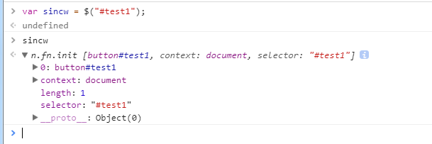

# Jquery核心函数


### 1、jQuery.fn.init


init方法根据传递的参数不同，实现了重载。


|类型（selector）|处理方式|
|:-|:------|
|DOM元素|包装成jQuery对象，直接返回|
|body（优化）|从document.body读取|
|单独的HTML标签|document.createElement|
|HTML字符串|document.createDocumentFragment|
|#id|document.getElementById|
|选择器表达式|$(…).find|
|函数|注册到dom ready的回调函数|

从上表可以看出，Jquery的主要功能就是对dom进行处理，为了方便对dom的操作，Jquery以一种类数组的方式将节点和实例对象关联起来，
让我们能够以用处理数组的方式来操作Jquery对象。

下面是我们使用$("#test")获取到的Jquery对象结构。



###  2、jQuery.extend = jQuery.fn.extend

```javascript
// 合并两个或更多对象的属性到第一个对象中，jQuery后续的大部分功能都通过该函数扩展

// 通过jQuery.fn.extend扩展的函数，大部分都会调用通过jQuery.extend扩展的同名函数

 

// 如果传入两个或多个对象，所有对象的属性会被添加到第一个对象target

 

// 如果只传入一个对象，则将对象的属性添加到jQuery对象中。

// 用这种方式，我们可以为jQuery命名空间增加新的方法。可以用于编写jQuery插件。

// 如果不想改变传入的对象，可以传入一个空对象：$.extend({}, object1, object2);

// 默认合并操作是不迭代的，即便target的某个属性是对象或属性，也会被完全覆盖而不是合并

// 第一个参数是true，则会迭代合并

// 从object原型继承的属性会被拷贝

// undefined值不会被拷贝

// 因为性能原因，JavaScript自带类型的属性不会合并

 

// jQuery.extend( target, [ object1 ], [ objectN ] )

// jQuery.extend( [ deep ], target, object1, [ objectN ] )

jQuery.extend = jQuery.fn.extend = function() {

    var options, name, src, copy, copyIsArray, clone,

       target = arguments[0] || {},

       i = 1,

       length = arguments.length,

       deep = false;

 

    // Handle a deep copy situation

    // 如果第一个参数是boolean型，可能是深度拷贝

    if ( typeof target === "boolean" ) {

       deep = target;

       target = arguments[1] || {};

       // skip the boolean and the target

       // 跳过boolean和target，从第3个开始

       i = 2;

    }

 

    // Handle case when target is a string or something (possible in deep copy)

    // target不是对象也不是函数，则强制设置为空对象

    if ( typeof target !== "object" && !jQuery.isFunction(target) ) {

       target = {};

    }

 

    // extend jQuery itself if only one argument is passed

    // 如果只传入一个参数，则认为是对jQuery扩展

    if ( length === i ) {

       target = this;

       --i;

    }

 

    for ( ; i < length; i++ ) {

       // Only deal with non-null/undefined values

       // 只处理非空参数

       if ( (options = arguments[ i ]) != null ) {

           // Extend the base object

           for ( name in options ) {

              src = target[ name ];

              copy = options[ name ];

 

              // Prevent never-ending loop

              // 避免循环引用

              if ( target === copy ) {

                  continue;

              }

 

              // Recurse if we're merging plain objects or arrays

              // 深度拷贝且值是纯对象或数组，则递归

              if ( deep && copy && ( jQuery.isPlainObject(copy) || (copyIsArray = jQuery.isArray(copy)) ) ) {

                  // 如果copy是数组

                  if ( copyIsArray ) {

                     copyIsArray = false;

                     // clone为src的修正值

                     clone = src && jQuery.isArray(src) ? src : [];

                  // 如果copy的是对象

                  } else {

                     // clone为src的修正值

                     clone = src && jQuery.isPlainObject(src) ? src : {};

                  }

 

                  // Never move original objects, clone them

                  // 递归调用jQuery.extend

                  target[ name ] = jQuery.extend( deep, clone, copy );

 

              // Don't bring in undefined values

              // 不能拷贝空值

              } else if ( copy !== undefined ) {

                  target[ name ] = copy;

              }

           }

       }

    }

    // Return the modified object

    // 返回更改后的对象

    return target;

};
```

> 如何实现一个继承方法

克隆需要考虑的有
- 浅克隆
	复制基本属性
	赋值复杂属性的引用

- 深度克隆
	
	1.克隆对象为空或者不是复杂对象 直接返回克隆对象
	
	2.克隆对象是方法 -----返回新的方法 new Function('return' obj.toString())();
	 
	3.克隆对象是数组或者对象
		
		1.如果是数组
			target = [];
		2.如果是对象
			target = {};
		3.循环对象的所有属性 
		for (name in obj){
            如果obj[name] == obj
            continue 防止死循环
		
		  
            1.如果是数组或者对象
                递归调用此方法
            2.如果是function
                target[name] =  new Function('return' obj.toString())();
            3.否则则为基本属性
                target[name] = value;
		}


```javascript

var sinw = {
    isFunction:function(){
        return (typeof obj == "function");       
    },
    isArray:function(obj){
        return   Array.isArray(obj) ;
        },
    isObject:function(){
        return (typeof obj == "object");    
            }
}

function copy(obj, deep) {
    if (obj === null || (typeof obj !== "object")) {
        return obj;
    } else if (sinw.isFunction(obj)) {
        return new Function("return " + obj.toString())();
    } else {
        var name, target = sinw.isArray(obj) ? [] : {}, value;
        for (name in obj) {
            value = obj[name];
            if (value === obj) {
                continue;
            }
            if (deep) {
                if (sinw.isArray(value) || sinw.isObject(value)) {
                    target[name] = copy(value, deep);
                } else if (sinw.isFunction(value)) {
                    target[name] = new Function("return " + value.toString())();
                } else {
                    target[name] = value;
                }
            } else {
                target[name] = value;
            }
        }
        return target;
    }
}
```

###  3、jQuery.ready()

在了解ready之前我们首先要了解dom文档加载的步骤：
- (1) 解析HTML结构。
- (2) 加载外部脚本和样式表文件。
- (3) 解析并执行脚本代码。
- (4) 构造HTML DOM模型。//ready
- (5) 加载图片等外部文件。
- (6) 页面加载完毕。//load

ready()函数用于在当前文档结构载入完毕后立即执行指定的函数。

在jquery脚本加载的时候,会设置一个isReady的标记,监听DOMContentLoaded事件(这个不是什么浏览器都有的,不同浏览器,jquery运作方式不一样).当然遇到调用ready函数的时候,如果isReady未被设置,那就是说页面未加载完,就会把要执行的函数用一个数组缓存起来,当页面加载完后,再把缓存的函数一一执行. 
代码分析如下
```javascript
// 绑定监听器 
ready: function(fn) { 
    // 绑定事件到DOM上
    bindReady(); 
    // 保存回调函数
    readyList.done(fn);
    //如果准备好了执行函数
    if(isReady){
        readyList.resolveWith( document, [ jQuery ] );
    }
    // 返回jQuery对象 
    return this; 
}
```
#### jquery对不同浏览器bindReady()函数实现。

> 高级浏览器   DOMContentLoaded 事件


```javascript

if ( document.addEventListener ) {
        // Use the handy event callback
        document.addEventListener( "DOMContentLoaded", completed );

        // 个别浏览器情况，错过了事件仍可触发
        window.addEventListener( "load", completed );

    
    } 
``` 

> IE浏览器   onreadystatechange事件

如果浏览器存在 document.onreadystatechange 事件，当该事件触发时，如果 document.readyState=complete 的时候，可视为 DOM 树已经载入。不过，这个事件不太可靠，比如当页面中存在图片的时候，可能反而在 onload 事件之后才能触发，换言之，它只能正确地执行于页面不包含二进制资源或非常少或者被缓存时的方案。

为了解决这个问题，Diego Perini 在 2007 年的时候，报告了一种检测 IE 是否加载完成的方式，使用 doScroll 方法调用，详情可见http://javascript.nwbox.com/IEContentLoaded/。
原理就是对于 IE 在非 iframe 内时，只有不断地通过能否执行 doScroll 判断 DOM 是否加载完毕。在上述中间隔 50 毫秒尝试去执行 doScroll，注意，由于页面没有加载完成的时候，调用 doScroll 会导致异常，所以使用了 try -catch 来捕获异常。
结论：所以总的来说当页面 DOM 未加载完成时，调用 doScroll 方法时，会产生异常。那么我们反过来用，如果不异常，那么就是页面DOM加载完毕了。

```javascript
// IE6-8不支持"DOMContentLoaded"
else if ( document.attachEvent ) {

       // Ensure firing before onload, maybe late but safe also for iframes
       document.attachEvent( "onreadystatechange", completed );

       // A fallback to window.onload, that will always work
       window.attachEvent( "onload", completed );

       // If IE and not a frame
       // continually check to see if the document is ready
       var top = false;

       try {
           top = window.frameElement == null && document.documentElement;
       } catch ( e ) {}

       if ( top && top.doScroll ) {
           ( function doScrollCheck() {

               // 防止重复触发
               if ( !jQuery.isReady ) {

                   try {
                       top.doScroll( "left" );
                   } catch ( e ) {
                       return window.setTimeout( doScrollCheck, 50 );
                   }

                   detach();
                   jQuery.ready();
               }
           } )();
       }

   }
```

> 具体实现
```javascript
var readyList;
 
jQuery.fn.ready = function( fn ) {
 
    // promise后添加回调
    jQuery.ready.promise().done( fn );
    return this;    // 链式
};
 
jQuery.extend( {
 
    // doScroll需借此判断防止重复触发
    isReady: false,
 
    // 需要几次jQuery.ready()调用，才会触发promise和自定义ready事件
    readyWait: 1,
 
    holdReady: function( hold ) {
        if ( hold ) {
            // true，延迟次数 +1
            jQuery.readyWait++;
        } else {
            // 无参数，消减次数 -1
            jQuery.ready( true );
        }
    },
 
    // 触发promise和自定义ready事件
    ready: function( wait ) {
 
        // ready(true)时，消减次数的地方。也能代替干ready()的事
        if ( wait === true ? --jQuery.readyWait : jQuery.isReady ) {
            return;
        }
 
        // ready()调用时，标记dom已加载完成
        jQuery.isReady = true;
 
        // ready()能够设置isReady，只能消减默认的那1次
        if ( wait !== true && --jQuery.readyWait > 0 ) {
            return;
        }
 
        // 触发promise，jQuery.fn.ready(fn)绑定函数都被触发
        readyList.resolveWith( document, [ jQuery ] );
 
        // 触发自定义ready事件，并删除事件绑定
        if ( jQuery.fn.triggerHandler ) {
            jQuery( document ).triggerHandler( "ready" );
            jQuery( document ).off( "ready" );
        }
    }
} );
 
// 解绑函数
function detach() {
    if ( document.addEventListener ) {
        document.removeEventListener( "DOMContentLoaded", completed );
        window.removeEventListener( "load", completed );
 
    } else {
        document.detachEvent( "onreadystatechange", completed );
        window.detachEvent( "onload", completed );
    }
}
 
// detach() + jQuery.ready()
function completed() {
 
    // readyState === "complete" is good enough for us to call the dom ready in oldIE
    if ( document.addEventListener ||
        window.event.type === "load" ||
        document.readyState === "complete" ) {
 
        detach();
        jQuery.ready();
    }
}
 
jQuery.ready.promise = function( obj ) {
    if ( !readyList ) {
 
        readyList = jQuery.Deferred();
 
        // 判断执行到这时，是否已经加载完成
        if ( document.readyState === "complete" ) {
 
            // 不再需要绑定任何监听函数，直接触发jQuery.ready。延迟一会，等代码执行完
            window.setTimeout( jQuery.ready );
 
        // Standards-based browsers support DOMContentLoaded
        } else if ( document.addEventListener ) {
 
            // Use the handy event callback
            document.addEventListener( "DOMContentLoaded", completed );
 
            // 个别浏览器情况，错过了事件仍可触发
            window.addEventListener( "load", completed );
 
        // IE6-8不支持"DOMContentLoaded"
        } else {
 
            // Ensure firing before onload, maybe late but safe also for iframes
            document.attachEvent( "onreadystatechange", completed );
 
            // A fallback to window.onload, that will always work
            window.attachEvent( "onload", completed );
 
            // If IE and not a frame
            // continually check to see if the document is ready
            var top = false;
 
            try {
                top = window.frameElement == null && document.documentElement;
            } catch ( e ) {}
 
            if ( top && top.doScroll ) {
                ( function doScrollCheck() {
 
                    // 防止重复触发
                    if ( !jQuery.isReady ) {
 
                        try {
                            top.doScroll( "left" );
                        } catch ( e ) {
                            return window.setTimeout( doScrollCheck, 50 );
                        }
 
                        detach();
                        jQuery.ready();
                    }
                } )();
            }
        }
    }
    return readyList.promise( obj );
};
 
// 执行。生成deferred对象，绑定好监听逻辑
jQuery.ready.promise();
```


如果ready在页面加载完毕后呢？
jQuery针对这样的情况跳过了绑定了：
```javascript
if ( document.readyState === "complete" ) {
     // Handle it asynchronously to allow scripts the opportunity to delay ready
     setTimeout( jQuery.ready );
 }
```

> 自己实现一个ready方法

```javascript
/*
 * 传递函数给whenReady()
 * 当文档解析完毕且为操作准备就绪时，函数作为document的方法调用
 */
var whenReady = (function() {               //这个函数返回whenReady()函数
    var funcs = [];             //当获得事件时，要运行的函数
    var ready = false;          //当触发事件处理程序时,切换为true
    
    //当文档就绪时,调用事件处理程序
    function handler(e) {
        if(ready) return;       //确保事件处理程序只完整运行一次
        
        //如果发生onreadystatechange事件，但其状态不是complete的话,那么文档尚未准备好
        if(e.type === 'onreadystatechange' && document.readyState !== 'complete') {
            return;
        }
        
        //运行所有注册函数
        //注意每次都要计算funcs.length
        //以防这些函数的调用可能会导致注册更多的函数
        for(var i=0; i<funcs.length; i++) {
            funcs[i].call(document);
        }
        //事件处理函数完整执行,切换ready状态, 并移除所有函数
        ready = true;
        funcs = null;
    }
    //为接收到的任何事件注册处理程序
    if(document.addEventListener) {
        document.addEventListener('DOMContentLoaded', handler, false);
        document.addEventListener('readystatechange', handler, false);            //IE9+
        window.addEventListener('load', handler, false);
    }else if(document.attachEvent) {
        document.attachEvent('onreadystatechange', handler);
        window.attachEvent('onload', handler);
    }
    //返回whenReady()函数
    return function whenReady(fn) {
        if(ready) { fn.call(document); }
        else { funcs.push(fn); }
    }
})();

function sincw1() {
    console.log('hi sincw1');
}
function sincw2() {
    console.log('hi sincw2');
}

// t2-t1-t2
whenReady(t1);
t2();
whenReady(t2);
```

### 4、jQuery.noConflict();

命名空间冲突处理，$这个操作符并不是Jquery的专属，其他JS的框架也可以使用这个操作符，Jquery使用noConflict
函数来处理这个问题。这个函数必须在你导入jQuery文件之后，并且在导入另一个导致冲突的库之前使用。

```javascript
Var _jQuery ,_$;

jQuery.noConflict = function( deep ) {
    if ( window.$ === jQuery ) {
        window.$ = _$;
    }
if ( deep && window.jQuery === jQuery ) {
        window.jQuery = _jQuery;
    }
    return jQuery;
};
//jQuery和$的控制权丢失后，可以使用其他变量来接收Jquery对象
var sQuery = jQuery.noConflict(true);

sQuery.("#sincw");

```

### 5、$.Callbacks

它是一个工厂函数，使用函数调用（非new，它不是一个类）创建对象，它有一个可选参数flags用来设置回调函数的行为，
对外的接口也就是self的返回。

```javascript
jQuery.Callbacks()的API列表如下：

callbacks.add()        ：回调列表中添加一个回调或回调的集合。
callbacks.disable()    ：禁用回调列表中的回调。
callbacks.disabled()   ：确定回调列表是否已被禁用。 
callbacks.empty()      ：从列表中删除所有的回调。
callbacks.fire()       ：用给定的参数调用所有的回调。
callbacks.fired()      ：访问给定的上下文和参数列表中的所有回调。 
callbacks.fireWith()   ：访问给定的上下文和参数列表中的所有回调。
callbacks.has()        ：确定列表中是否提供一个回调。
callbacks.lock()       ：锁定当前状态的回调列表。
callbacks.locked()     ：确定回调列表是否已被锁定。
callbacks.remove()     ：从回调列表中的删除一个回调或回调集合。
```

```javascript
function fn1(val) {
  console.log('fn1 says:' + val);
}

function fn2(val) {
  console.log('fn2 says ' + val);
}
var cbs = $.Callbacks();
cbs.add(fn1);
cbs.fire('foo');
console.log('........')
cbs.add(fn2);
cbs.fire('bar')
  
//printout
//fn1 says:foo 
//………………………
//fn1 says:bar 
//fn2 says bar
```
