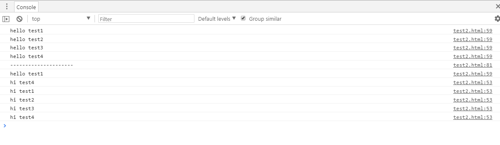

# 04-Jquery链式调用


### 链式调用
 jQuery的核心理念是Write less,Do more(写的更少,做的更多)，那么链式方法的设计与这个核心理念不谋而合
 ```javascript
$('input[type="button"]').eq(0).click(
    function() {
    alert('点击我!');
}).end().eq(1).click(
    function() {
    $('input[type="button"]:eq(0)').trigger('click');
}).end().eq(2).toggle(
    function() {
    $('.sinw').hide('slow');
}, function() {
    $('.sinw').show('slow');
});
```

上面代码的含义是

  ☑  找出type类型为button的input元素

  ☑  找到第一个按钮，并绑定click事件处理函数

  ☑  返回所有按钮，再找到第二个

  ☑  为第二个按钮绑定click事件处理函数

  ☑  为第三个按钮绑定toggle事件处理函数

通过简单扩展原型方法并通过return this的形式来实现跨浏览器的链式调用。

### 自己实现一个简单的链式调用

```html
<!DOCTYPE HTML>
<html>
<head>
    <meta http-equiv="Content-Type" content="text/html; charset=utf-8">
    <title>无标题文档</title>
</head>
<body>

<button id="test1">test1</button>
<button id="test2">test2</button>
<button id="test3">test3</button>
<button id="test4">test4</button>

<script type="text/javascript">
    //创建工厂用于生产链式调用的对象，并在原型上添加方法
    (function(){
        function _$(obj){
            var elements;
            if(typeof obj === "string"){
                elements = document.getElementsByTagName(obj);
            }else if(Array.isArray(obj)){
                elements = obj;
            }else{
                elements = [obj];
            }
            this.elements = elements;
        }

        _$.prototype = {
            each : function(fn){
                for(var i = 0, len = this.elements.length; i < len; i++){
                    fn.call(this.elements[i], this.elements[i]);
                }
                return this;
            },
            sayHi : function(){
                this.each(function(){
                    console.info("hi " + this.id);
                });
                return this;
            },
            sayHello:function(){
                this.each(function(){
                    console.info("hello " + this.id);
                });
                return this;
            },
            //由工厂产生一个新的对象，并设置其父亲
            eq:function(i){
                var that = new _$(this.elements[i])
                //Jquery在构建Jquery对象的时候就将pre赋值了
                that.pre = this;
                return that;
            },
            //返回其父亲
            end:function(){
                return  this.pre;
            }
        }

        // 公开接口
        window.$ = function(tagname){
            return new _$(tagname);
        }
    })();
    
    var sincw = $("button");
    sincw.sayHello();
    console.info("---------------------")
    sincw.eq(0).sayHello().end().eq(3).sayHi().end().sayHello();

</script>

</body>
</html>


```




### prevObject

.jpg)

prevObject就是上例中的pre,在什么情况下会产生？在构建jQuery对象的时候，通过pushStack方法构建

```javascript
jQuery.fn.extend({
    find: function(selector) {

        //...........................

        //通过sizzle选择器，返回结果集
        jQuery.find(selector, self[i], ret);

        // Needed because $( selector, context ) becomes $( context ).find( selector )
        ret = this.pushStack(len > 1 ? jQuery.unique(ret) : ret);
        ret.selector = this.selector ? this.selector + " " + selector : selector;
        return ret;
    }
})
```

##### pushStack

通过新的DOM元素去创建一个新的jQuery对象

```javascript
pushStack: function( elems ) {
    // Build a new jQuery matched element set
    var ret = jQuery.merge( this.constructor(), elems );

    // Add the old object onto the stack (as a reference)
    ret.prevObject = this;
    ret.context = this.context;

    // Return the newly-formed element set
    return ret;
 }
```

流程解析：

1、首先构建一个新的jQuery对象，因为constructor是指向构造器的，所以这里就等同于调用jQuery()方法了，返回了一个新的jQuery对象；

2、然后用jQuery.merge语句把elems节点合并到新的jQuery对象上；

3、最后给返回的新jQuery对象添加prevObject属性，我们看到prevObject其实还是当前jQuery的一个引用罢了，所以也就是为什么通过prevObject能取到上一个合集的原因了。
