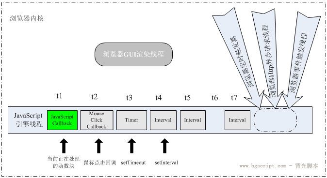

# 异步队列Deferred

JS是单线程的语言，对于拿到的程序，一行一行的执行，上面的执行没有完成，就傻傻的等着

```javascript
var sincw = 'hi';
for (i = 0; i < 1000000000; i++) {
}
console.info(sincw);
```

在输出hi之前，必须要等待for循环执行完毕。

### 浏览器JS线程

在浏览器中运行的JS，会有大量的网络请求，如果每个请求都要等待资源返回在处理，那网页带给用户的体验将会非常差。


一个tab页中js代码始终在一个线程上执行，此线程被称为js引擎线程。
一个tab页是一个render进程，不止有JS引擎线程，还有GUI渲染线程，事件触发线程，定期器触发线程，
异步http请求线程。

### 线程间的通信

> http请求线程

当发起HTTP请求时，XMLHttpRequest在连接后是通过浏览器新开一个http请求线程，
将检测到状态变更时，如果设置有回调函数，异步线程就产生状态变更事件，将这个回调再放入JS引擎事件队列中。再由JavaScript引擎执行。

> 事件触发线程

用户点击鼠标 -》 被浏览器的事件触发线程捕获 -》 形成一个鼠标点击事件添加到 JS引擎的处理队列 末尾

> 定时触发线程

指定一个时间间隔，表示何时将定时器的代码插入到 JS引擎的处理队列，而不是何时执行代码。其等待的时间基于队列里正在等待的消息数量。

> JS引擎线程 与 界面渲染线程：互斥

界面渲染线程负责渲染浏览器界面HTML元素,当界面需要重绘(Repaint)或由于某种操作引发回流(reflow)时,该线程就会执行.
JavaScript脚本可操纵DOM元素，如果在修改这些元素属性的同时渲染界面,那么渲染线程前后获得的元素数据就可能不一致了。
在JavaScript引擎运行脚本期间，浏览器渲染线程都是处于挂起状态的,
所以，在脚本中对界面进行更新操作，如添加结点、删除结点或改变结点的外观等更新并不会立即体现出来，这些操作将保存在一个队列中，待JavaScript引擎空闲时才有机会渲染出来.




### 异步队列 Deferred 原理

下面是JQuery中异步队列Deferred的用法：
```javascript
<!DOCTYPE html>
<html lang="en">
<head>
    <meta charset="UTF-8">
    <title>Title</title>
</head>
<body>
</body>
<!--<script src="deferred.js"></script>-->
<script src="jquery-2.1.1.js"></script>
<script>
    function asynDosome(flag) {
        var def = $.Deferred();
        setTimeout(function () {
            if (flag) {
                var value = "OK";
                def.resolve(value);
            } else {
                var value = "FAIL";
                def.reject(value);
            }
        }, 1000);
        return def.promise();
    }

    asynDosome(true).done(function (message) {
        console.info(message);
    }).done(function (message) {
        return asynDosome(false);
    }).fail(function (err) {
        console.info(err);
    })
</script>
</html>

```

大致的逻辑是这样的：

- 1.调用deffered.promise对象的then方法，将函数放入callbacks队列进行函数注册。类似观察者模式。

- 2.构建deffered对象，它会接受一个参数value,代表异步返回的结果，当异步操作成果后，调用resolve方法，
执行callbacks队列中的回调函数。


#### Deferred Jquery源码

水平有限，源码很多地方不清楚，下面是查阅资料时看到比较好的解析。

https://www.imooc.com/code/3774

```javascript
<!DOCTYPE HTML>
<html>
<head>
<meta http-equiv="Content-Type" content="text/html; charset=utf-8">
<script src="http://code.jquery.com/jquery-latest.js"></script>
<title></title>
</head>
<body>

<button>测试Deferred</button>

<script type="text/javascript">
      
    function Deferred(){
      //内部deferred对象
      var deferred = {};

      //定义的基本接口
      //Callbacks(once memory)的用法，就是只执行一次，并且保持以前的值
      // 每个元组分别包含一些与当前deferred相关的信息: 
      // 分别是：触发回调函数列表执行(函数名)，添加回调函数（函数名），回调函数列表（jQuery.Callbacks对象），deferred最终状态（第三组数据除外）
      // 总体而言，三个元组会有对应的三个callbacklist对应于doneList, failList, processList
      var tuples = [
        ["resolve", "done", jQuery.Callbacks("once memory"), "resolved"],
        ["reject", "fail", jQuery.Callbacks("once memory"), "rejected"],
        ["notify", "progress", jQuery.Callbacks("memory")]
      ];

      //deferred的状态，三种：pending(初始状态), resolved(解决状态), rejected(拒绝状态)
      //其实就是tuples最后定义的
      var state = "pending";

      //内部promise对象,作用：
      //1：通过promise.promise( deferred );混入到deferred中使用
      //2：可以生成一个受限的deferred对象，
      //   不在拥有resolve(With), reject(With), notify(With)这些能改变deferred对象状态并且执行callbacklist的方法了
      //   换句话只能读，不能改变了
      //扩展
      //  done fail pipe process 
      var promise = {
        state: function() {},
        always: function() {},
        then: function() {},
        promise: function(obj) {
          return obj != null ? jQuery.extend(obj, promise) : promise;
        }
      }

      //管道接口,API别名
      promise.pipe = promise.then;

      //遍历tuples
      //把定义的接口混入到deferred中
      jQuery.each(tuples, function(i, tuple) {
        var list = tuple[2],
          stateString = tuple[3];

          // 给上面的promise对象添加done，fail，process方法
          // 分别引用三个不同 jQuery.Callbacks("once memory")对象的add方法，在初始化就构建成了对象
          // 向各自的回调函数列表list（各自闭包中）中添加回调函数，互不干扰
          // promise = {
          //    done:
          //    fail:
          //    process
          // }
          promise[tuple[1]] = list.add;

        if (stateString) {
          list.add(function() {
            state = stateString;
          }, tuples[i ^ 1][2].disable, tuples[2][2].lock);
        }
        deferred[tuple[0]] = function() {
          deferred[tuple[0] + "With"](this === deferred ? promise : this, arguments);
          return this;
        };
        deferred[tuple[0] + "With"] = list.fireWith;
      });
      //混入方法
      promise.promise(deferred);

      return deferred;
    }


  $("button").on("click", function() {
    var dtd = Deferred();
    // 给deferred注册一个成功后的回调通知
    dtd.done(function() {
       $('body').append('<li>Deferred成功</li>')
    })
    // 开始执行一段代码
    setTimeout(function() {
      dtd.resolve(); // 改变deferred对象的执行状态
    }, 500);
  })


</script>

</body>
</html>
```

### Deferred 简单实现

```javascript
/**
 * promise类
 * @constructor
 */
function Promise() {
    this.handlerQueue = [];
    this.isPromise = true;
}

/**
 * 注册函数
 * @param onFulfilled 成功函数
 * @param onRejected  失败函数
 * @returns {Promise} 返回this链式调用
 */
Promise.prototype.then = function (onFulfilled, onRejected) {
    var handler = {};
    if (typeof onFulfilled === 'function') {
        handler.resolve = onFulfilled;
    }
    if (typeof onRejected === 'function') {
        handler.reject = onRejected;
    }
    
    //解决Promise异步操作成功这之后调用的then注册的回调就再也不会执行了
    //挂起时添加函数至队列，已完成时直接执行函数，失败时什么也不做
    if(this._deferred.state === "pending"){
        this.handlerQueue.push(handler);
    }else if(this._deferred.state === "fulfilled"){
        onFulfilled(this.result);
    }

    return this;
}

/**
 * 注册函数
 * @param onRejected 扑捉异常函数
 * @returns {Promise} 返回this链式调用
 */
Promise.prototype.catch = function (onRejected) {
    var handler = {}
    if (typeof onRejected === 'function') {
        handler.reject = onRejected
    }
    if(this._deferred.state === "pending"){
        this.handlerQueue.push(handler);
    }else if(this._deferred.state === "rejected"){
        onRejected(this.result);
    }
    this.handlerQueue.push(handler)
    return this
}

/**
 * 异步对象
 * @constructor
 */
function Deferred() {
    this.state = 'pending';
    this.promise = new Promise();
    this.promise._deferred = this;
}

/**
 * 回调已完成时执行，释放回调队列
 * @param obj 回调结果值
 */
/**
 * 回调成功时执行，释放回调队列
 * @param obj 回调结果值
 */
Deferred.prototype.resolve = function (obj) {
    this.state = 'fulfilled';
    var handler, promise = this.promise;
    //就是通过setTimeout机制，将resolve中执行回调的逻辑放置到JS任务队列末尾
    //保证在resolve执行时，then方法的回调函数已经注册完成.
    setTimeout(function () {
        while (handler = promise.handlerQueue.shift()) {
            if (handler && handler.resolve) {
                var res = handler.resolve(obj)
                if (res && res.isPromise) {
                    //当返回值是Deferred对象时，继承父Deferred的回调队列，将子promise对象赋值给父promise
                    res.handlerQueue = promise.handlerQueue;
                    res._deferred = this;
                    this.promise = res;
                    this.result = obj;
                    return;
                } else {
                    //值传递
                    obj = res;
                }
            }
        }
        //返回结果保存用于执行以后完成后注册的then函数.
        this.result = obj;
    }, 0)

}

/**
 * 同上
 * @param obj
 */
Deferred.prototype.reject = function (obj) {
    this.state = 'rejected'
    var promise = this.promise
    var handler = {};
    setTimeout(function () {
        while (handler = promise.handlerQueue.shift()) {
            if (handler && handler.reject) {
                var res = handler.reject(obj)
                if (res && res.isPromise) {
                    //当返回值是Deferred对象时，继承父Deferred的回调队列，将子promise对象赋值给父promise
                    res.handlerQueue = promise.handlerQueue;
                    res._deferred = this;
                    this.promise = res;
                    this.result = obj;
                    return;
                } else {
                    //值传递
                    obj = res;
                }
            }
        }
        this.result = obj;
    }, 0)
}

/**
 * 测试函数.
 * @param flag 异步结果
 * @param name 回调信息
 * @returns {Promise|*}
 */
function asyncDosomeing(flag, name) {
    const deferred = new Deferred()
    setTimeout(function () {
        if (flag) {
            deferred.resolve({code: 200, message: '成功', name: name})
        } else {
            deferred.reject({code: 400, message: '失败', name: name})
        }
    }, 1000)
    return deferred.promise
}

asyncDosomeing(true, 'asyncDosomeing1').then(function (result) {
    console.info(result)
    return asyncDosomeing(false, 'asyncDosomeing2')
}).then(function (result) {
    console.info(result)
    return 'middle'
}).catch(function (err) {
    console.info('catch')
    console.info(err)
    return asyncDosomeing(true, 'asyncDosomeing3----catch')
}).then(function (result) {
    console.info("sincw")
    console.info(result)
})


/**
 * 在使用第三方异步模块时，这些模块的异步回调API 不支持我们的promise写法
 * 实现一个 方法可以批量将方法Promise化，--注释掉上方的测试代码食用更佳
 */

/**
 * 传递给模块的回调.
 */
Deferred.prototype.callBack = function () {
    var that = this
    return function (err, result) {
        if (err) {
            that.reject(result)
        } else {
            that.resolve(result)
        }
    }
}

var promisify = function (method) {
    if (typeof method !== 'function') {
        throw new TypeError('is not a function')
    }
    return function () {
        const defrred = new Deferred()
        var args = Array.prototype.slice.call(arguments, 0) // 克隆参数
        args.push(defrred.callBack())
        method.apply(this, args)
        return defrred.promise
    }
}

function asyncdemo(flag, name, callback){
    setTimeout(function () {
        callback(flag,{code: 400, name: name});
    }, 1000)
}

var readFile = promisify(asyncdemo);
readFile(false,"sincw").then(function(result){
    console.info(result);
    return readFile(true,"sincw2");
}).then(function(result){
    console.log(result)
}).catch(function(error){
    console.info(error);
});

```

